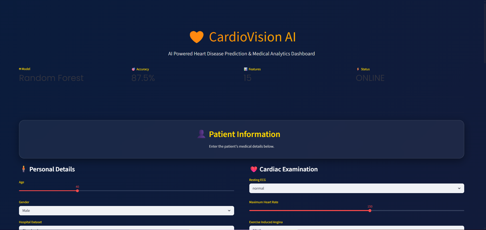
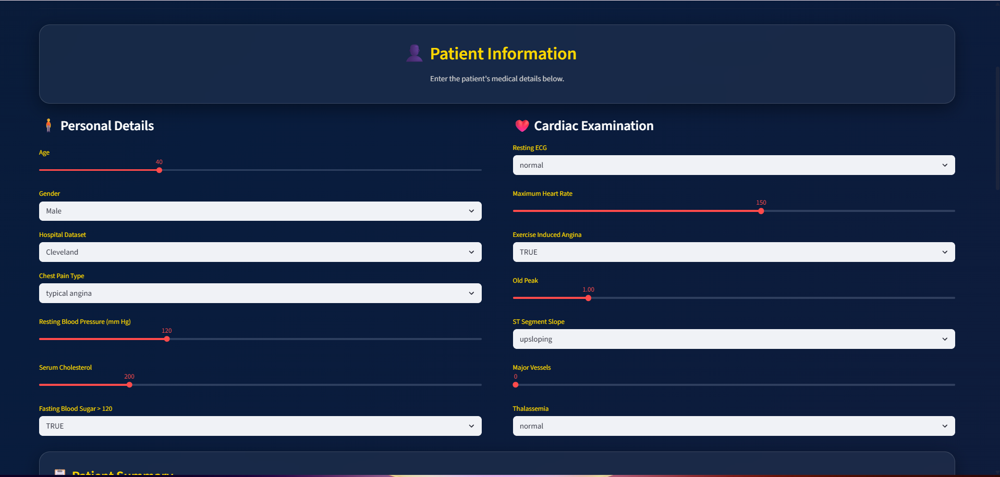
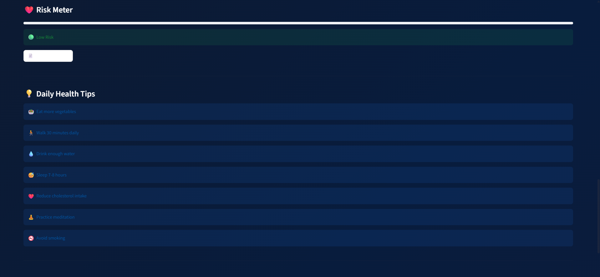
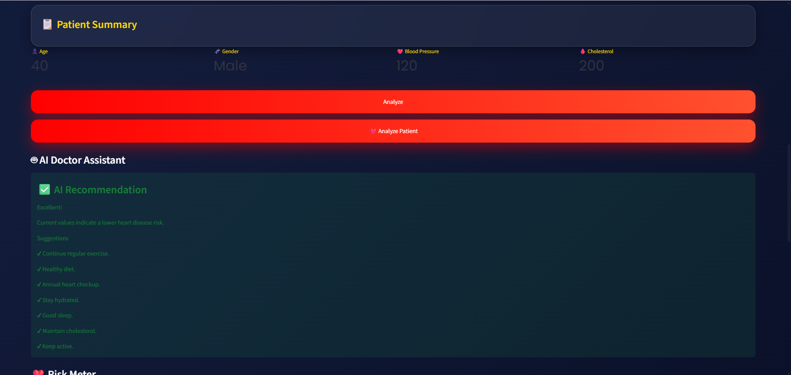

# ❤️ CardioVision AI

<p align="center">
  
</p>

<p align="center">


</p>

## 🩺 Overview

**CardioVision AI** is an intelligent **Heart Disease Prediction Dashboard** built using **Machine Learning** and **Streamlit**.

The application predicts whether a patient is at risk of heart disease based on clinical parameters and provides an interactive dashboard with AI-powered insights, confidence scores, charts, and health recommendations.

> **Disclaimer:** This application is for educational purposes only and is not a substitute for professional medical advice.

---

## ✨ Features

- ❤️ Heart Disease Prediction using Machine Learning
- 🤖 Random Forest Classifier
- 📊 Interactive Dashboard
- 📈 Plotly Visualizations
- 🎯 Confidence Score
- 🩺 AI-Based Health Recommendations
- 📋 Patient Summary
- 📄 Downloadable Prediction Report
- 🌙 Modern Responsive UI
- ⚡ Fast Prediction

---

## 📸 Screenshots

### Dashboard



### Prediction Result



### Analytics



### Summary

---

## 🧠 Machine Learning Workflow

```text
Patient Data
      │
      ▼
Data Preprocessing
      │
      ▼
Random Forest Model
      │
      ▼
Prediction
      │
      ▼
Confidence Score
      │
      ▼
AI Recommendation
```

---

## 🛠 Tech Stack

| Technology | Usage |
|------------|-------|
| Python | Programming Language |
| Streamlit | Web Application |
| Pandas | Data Processing |
| NumPy | Numerical Computing |
| Scikit-Learn | Machine Learning |
| Plotly | Data Visualization |
| Joblib | Model Serialization |

---

## 📂 Project Structure

```text
CardioVision-AI
│
├── app.py
├── train_model.py
├── model.pkl
├── heart.csv
├── requirements.txt
├── README.md
├── LICENSE
├── .gitignore
│
├── assets/
│   ├── banner.png
│   └── logo.png
│
└── screenshots/
    ├── dashboard.png
    ├── prediction.png
    └── charts.png
```

---

## ⚙️ Installation

### Clone Repository

```bash
git clone https://github.com/malli2247/CardioVision-AI.git
```

### Navigate to Folder

```bash
cd CardioVision-AI
```

### Install Dependencies

```bash
pip install -r requirements.txt
```

### Run the Application

```bash
streamlit run app.py
```

---

## 📊 Model Information

- **Algorithm:** Random Forest Classifier
- **Dataset:** UCI Heart Disease Dataset
- **Accuracy:** **87.5%**

---

## 🎯 Input Features

- Age
- Gender
- Chest Pain Type
- Resting Blood Pressure
- Cholesterol
- Fasting Blood Sugar
- Resting ECG
- Maximum Heart Rate
- Exercise-Induced Angina
- Old Peak
- ST Segment Slope
- Number of Major Vessels
- Thalassemia

---

## 💡 Future Improvements

- 🔐 User Authentication
- ☁️ Cloud Deployment
- 📱 Mobile Version
- 📄 PDF Medical Report
- 📊 Advanced Analytics
- 🧠 Deep Learning Model
- 🏥 Hospital Locator
- 🌐 Multi-language Support

---

## 👨‍💻 Author

**Boya Mallikarjuna**

- GitHub: https://github.com/malli2247
- LinkedIn: *(Add your LinkedIn profile here)*

---

## 🤝 Contributing

Contributions, suggestions, and improvements are welcome.

Feel free to fork the repository and submit a pull request.

---

## 📜 License

This project is licensed under the **MIT License**.

---

## ⭐ Support

If you found this project helpful, consider giving it a **⭐ Star** on GitHub.

It helps others discover the project and motivates further improvements.

---

<p align="center">

❤️ **Made with Python, Machine Learning, and Streamlit**

</p>
